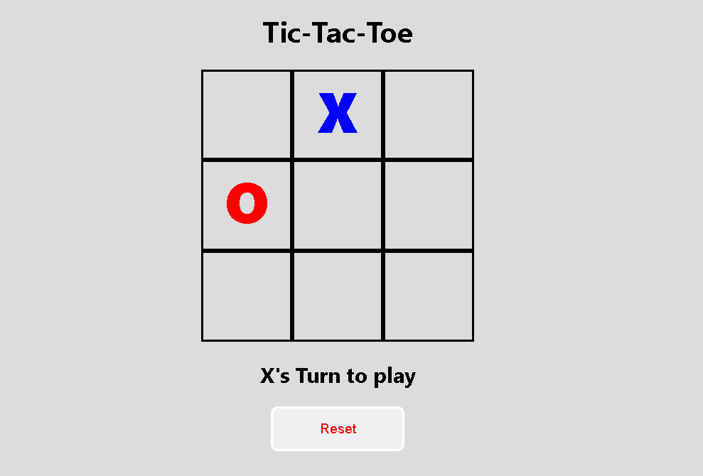
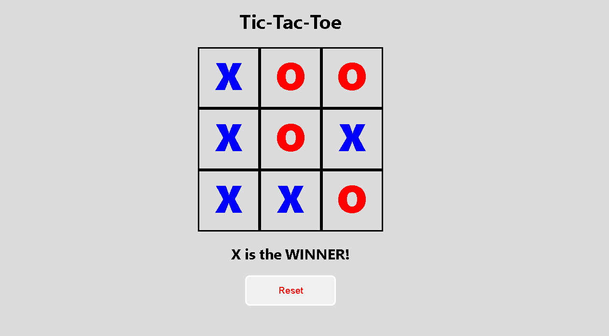
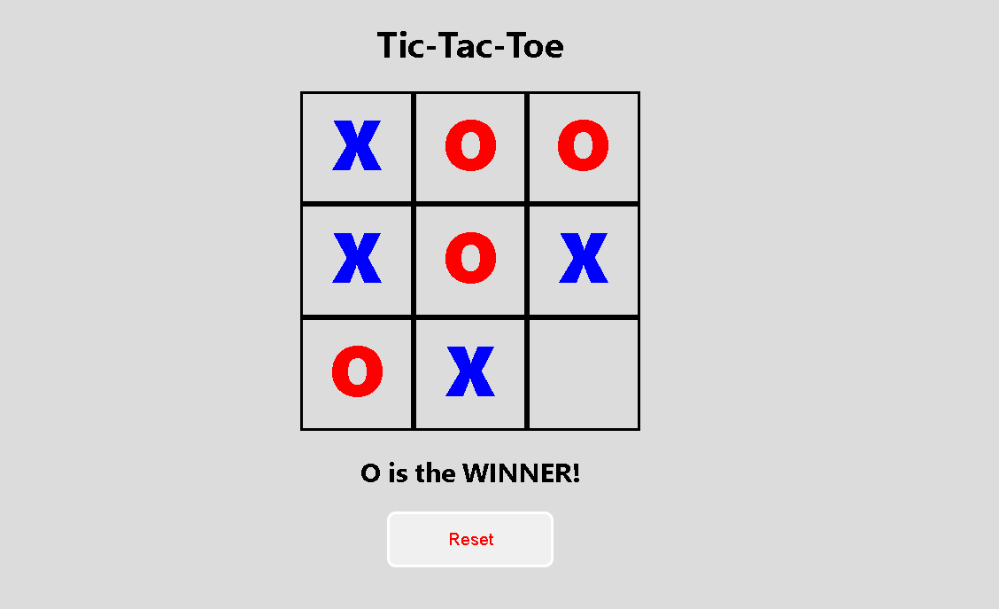
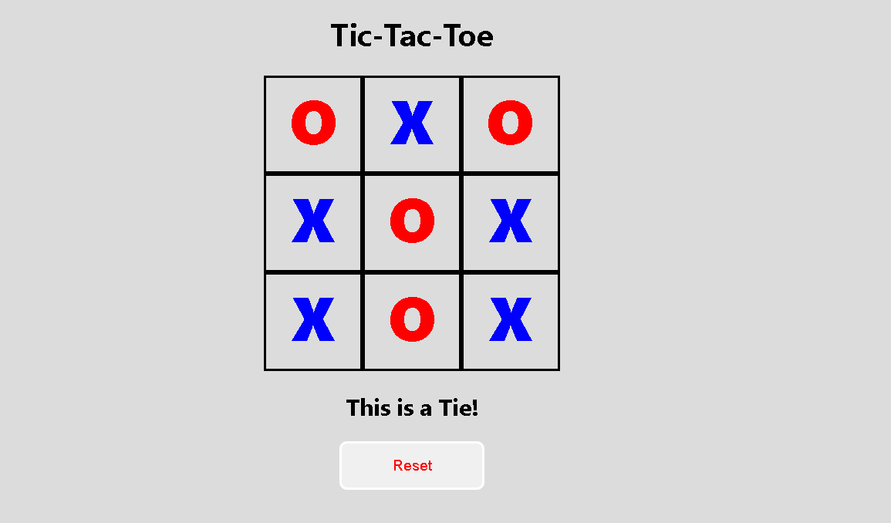

# Tic Tac Toe (XO)

## Technologies Used

- HTML
- CSS
- Javascript
- Git and Github

## Description

Tic Tac Toe, A simple web app for two players (X and O). Each Player take turns clicking squares on a 3x3 board. The game shows whose turn it is, detects a win, loss, or a tie, and includes a Reset button to start a new round.

This implementation uses [index.html](index.html) for the structure , [style.css](style.css) for design, and [app.js](app.js) for game logic.

## Features

- 3x3 Tic-Tac-Toe board with clickable squares
- Alternating turns between `X` and `O`
- Win detection for all standard winning combinations
- Tie detection when the board is full with no winner
- Visual distinction between `X` (blue) and `O` (red)
- Reset button to restart the game

## User Stories

- As a user, I want to click an empty square to place my mark so I can take my turn.
- As a user, I want the UI to show whose turn it is so I know when to play.
- As a user, I want the game to declare a winner when three marks align so the result is clear.
- As a user, I want the game to detect a tie when all squares are filled with no winner.
- As a user, I want a Reset button so I can start a new game at any time.

## Screenshots

## Future Enhancements

- Add a scoreboard to track wins across rounds.
- Highlight the winning combination on victory.
- Add single-player mode vs a CPU opponent.
- Improve styling and add animations.

## Credits

- Mr. Omar Kamal (https://github.com/omarakamal)
- Mr. Zaid (https://github.com/justzaid)
- Mrs. Israa Ashoor (https://github.com/ISRAA-ASHOOR)

